# 进入自己的个人网站
个人网站仓库地址：
https://github.com/Tao-oooo/Tao-oooo.github.io.git
去掉中间部分即为个人网站地址
https://tao-oooo.github.io/

# Github仓库中创建文件夹
1. 点击Create New File
2. 输入文件夹名字

输入名字后这里还是File，这时需要在名字后加上"/"，此时会自动生成文件夹
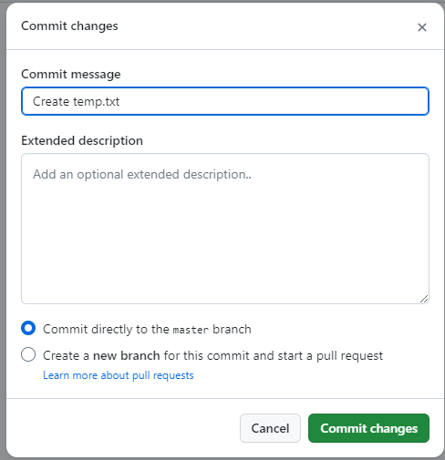

因为Github不允许创建空文件，因此需要新建一个临时文件
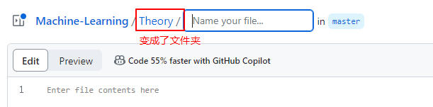
然后点击右上角“Commit changes”
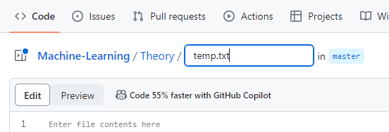


# 初次使用Github上传代码
## 在 Github 上创建新的仓库
这边可以看网上的资料创建仓库。

## 安装 Git 工具包
Git 工具包可以去官方网站下载，并安装。
安装完成后，Windows 系统的开始菜单中会有 Git 软件，如下图所示：
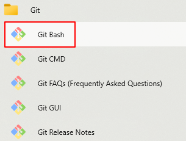
其中， Git Bash 就是 Git 工具的命令行窗口，后续的 GitHub 相关操作都会在此命令行窗口中执行。

## 在 Github 上添加 SSH Key
在 GitHub 上添加 SSH Key 之前需要在本地先生成 SSH Key。
打开上面讲到的 Git Bash 命令行窗口，先使用以下命令配置一下 Git Config：
```bash
git config --global user.name "username"
git config --global user.email "emile-name@email.com"
```
`username` 和 `emile-name@email.com` 的信息要与 Github 上申请的账号一致。

然后通过以下命令生成 SSH Key：
```bash
ssh-keygen -t rsa -C "emile-name@email.com"
```
这里的邮箱也要与 Github 上的一致，使用此命令后，如果不需要做其他特殊设置的话可以一路回车到底，最后 Git Bash 上可见如下的画面：
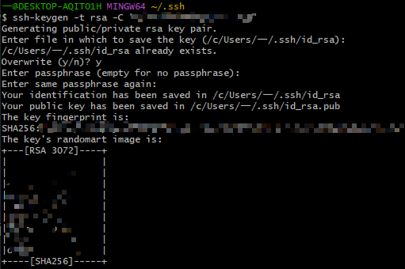

然后使用如下命令查看 SSH Key 的内容：
```bash
cat ~/.ssh/id_rsa.pub
```
内容如下：
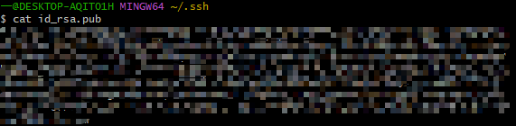

最后复制上述 SSH Key 的内容，填到 Github 网站即可。

## 从本地仓库上传代码到 Github 上
### 检查是否与 Github 连接成功
添加 SSH Key 后，在 Git Bash 中输入如下命令查看是否成功连接 Github：
```bash
ssh -T git@github.com
```

---

有时候可能会出现报如下错误的情况 [https://zhuanlan.zhihu.com/p/521340971]，
`ssh: connect to host github.com port 22: Connection refused` 这个错误提示的是连接 `github.com` 的22端口被拒绝了。此时可以尝试连接 443 端口，做法是修改 SSH 的配置文件。在 Git Bash 中使用 vim 命令打开 config：
```bash
vim ~/.ssh/config
```
然后再config文件中输入如下文本：
```bash
Host github.com
  Hostname ssh.github.com
  Port 443
```
然后输入如下命令保存退出
```bash
:wq
```
回车后即可保存，再次检验是否连接成功
```bash
ssh -T git@github.com
```

---

如果连接成功，则会提示如下信息 (如果是第一次的会提示是否continue，输入yes即可)：
```
Hi xxxxx! You've successfully authenticated, but GitHub does not
provide shell access.
```
如图所示：
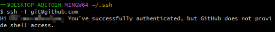

### 上传文件
首先进入本地仓库文件夹，如果还没有本地仓库文件夹，那么可以创建一个新的文件夹。通常的做法是，本地仓库文件夹的名称与 GitHub 仓库名称一致。新创建的文件夹没有 Git Branch 的概念，所以需要先创建分支。可以使用如下命令创建主分支：
```bash
git init
```
完成后会在文件夹后面显示主分支名，如图中红框所示：
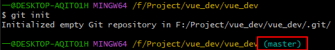
`master` 就是主分支名字，最新版的 GitHub 主分支名变成了 `main` ，但两者其实是一个意思。

如果我们从 GitHub 上手动下载了项目文件夹 (非 `git clone` 的方式下载的项目) ，那么此文件夹同样会没有分支名称。所以使用 Git Bash 进入项目文件夹时并不会显示 `master` 或 `main` 之类的分支名称。此时如果希望将修改后的项目代码上传到 GitHub ，那么同样需要使用上述命令创建分支。为了避免出现未知问题，建议使用 `git clone` 命令拉取项目代码，而非使用手动下载的方式。使用 `git clone` 拉取的项目文件夹会将整个项目的代码更新状态统一保存，方便后续查看。

一种简单的查看项目文件夹是否创建分支的方法：打开隐藏文件可视化，如果项目文件夹中出现 `.git` 文件夹，则说明此项目有分支信息，否则无分支信息。

然后使用如下命令与 Github 上新建项目连接：
```bash
git remote add origin xxx
```
xxx 部分就是 Github 仓库的链接，如下图所示：
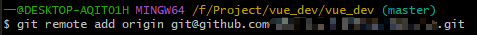

接着使用如下命令将本地仓库中的文件加入暂存区：
```bash
git add .
```
`.` 表示将本地文件夹下所有文件都加入暂存区。
如图所示：
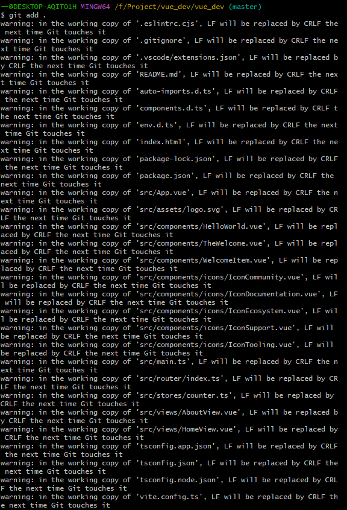

然后为本地上传文件添加注释，方便以后查看：
```bash
git commit -m "20240922"
```
"20240922" 就是加的注释，可以按照需求添加内容。
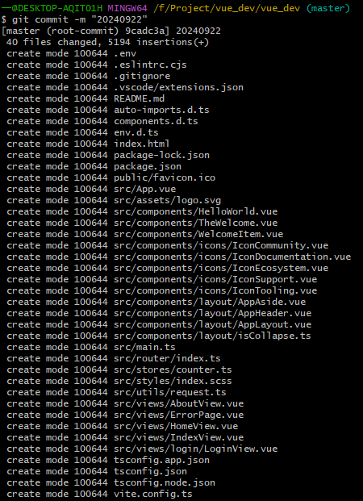

最后就可以提交本地文件到 Github 新建项目中了，使用如下命令：
```bash
git push origin master
```
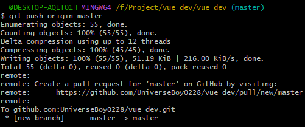

# 参考文献

https://zhuanlan.zhihu.com/p/138305054
https://zhuanlan.zhihu.com/p/193140870