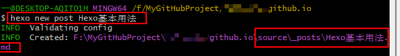
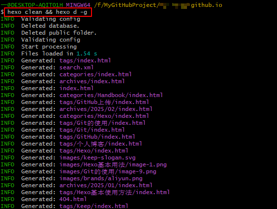
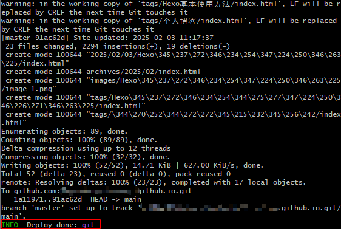

# 新建一篇博客文章
## 新建一篇需要发布的博客文章
打开命令行窗口，这里以 Git Bash 为例， Windows CMD 同样可以进行相同操作，使用如下命令新建一篇博客文章：
```bash
hexo new post 博客文章名称
```
使用上述命令后，在个人博客项目的 `source/_posts` 目录下会自动生成 `博客文章名称.md` 文件，如下图所示。


只需再此文件中编辑需要发布的内容即可。

## 新建一篇草稿文章
1.1 节中的 `hexo new post` 命令是新建一篇马上要发布的文章，在使用发布文章命令后，此文章就会被上传到博客网站。即使此文章还未编辑完成，仍然会被发布出去，也就是说博客网站仍然能看到尚未完成的文章。所以 Hexo 提供了草稿模式，使用如下命令就可以创建一篇草稿文章：
```bash
hexo new draft 博客文章名称
```
使用上述命令后，会在 `source` 目录下生成 `/_drafts` 目录，并将新建的文章保存进此目录中。此时再次使用发布文章命令时，此文件夹下的文章不会被更新到博客网站。
当草稿文章完成编辑后，需要将其移至 `/_posts` 目录下才可进行发布，使用如下命令即可将文章放入 `/_posts` 目录中，即将草稿文章发布为正式文章：
```bash
hexo publish post 博客文章名词
```

# 本地预览
如果我们想在博客内容发布前先本地预览，则使用如下命令即可：
```bash
hexo server
```
当然，直接使用上面的命令并不会显示草稿文章。如果我们希望草稿文章也同样被预览，则可以使用如下命令：
```bash
hexo server --draft
```

# 正式发布文章
依然是在 Git Bash 中操作，使用如下命令行将更新的博客文章上传到 github.io 仓库中。
```bash
hexo clean && hexo d -g
```

这里需要注意的是， `hexo clean && hexo d -g` 实际上是 2 句命令行，拆分为 `hexo clean` 和 `hexo d -g` 分别运行也是可以的。另外， `hexo` 命令在 Windows CMD 中同样可以运行，但是无法识别 `&&` 的含义，此时就可以将其拆分为 2 条命令分别运行。

运行命令后如下图所示，出现 `Deploy done: git` 则表示发布成功。



# 删除一篇文章
从本地的 `/_posts` 文件夹中删除需要删除的文章，并执行正式发布文章的命令，即可完成文章的删除。

# 更改本地预览的 IP 地址和端口号
如果想要主动更换 IP 地址或端口号，或者使用 `hexo server` 命令进行本地预览时，默认情况下，预览网站是 `http://localhost:4000` 。有时候可能会出现此地址的 IP 地址和端口号冲突导致无法本地预览 (比如还有其他后端服务也使用此地址) ，在执行时遇到了 `EADDRINUSE` 错误，此时需要更改 IP 地址和端口号避免冲突发生.
可以使用如下命令更改端口号：
```bash
hexo server -p 8000
```
可以使用如下命令更改 IP 地址：
```bash
hexo server -i 127.0.0.2
```
如果两个都想修改，则使用如下命令：
```bash
hexo server -i 127.0.0.2 -p 8000
```

# 博客文章文件名修改
在新建博客文章时使用 `hexo new post 博客文章名称` 命令会生成 `博客文章名称.md` 文件，并且在文件内会自动生成博客文章标题 (在博客网站上显示的标题) ，如下所示。
```
---
title: Hexo基本用法
date: 2025-02-03 11:02:27
tags: [Hexo, 个人博客, Hexo基本使用方法]
categories: [Handbook]
---
```
正常情况下， `title` 名称会与新建的文件名称一致。
但有时会在创建文章后又对文件名不满意，如果仅仅修改 `title` ，就会造成 `source/_post` 下的文件名 oldFileName.md 和内文标题 title 不一致的情况。
这里如果手工将 oldFilename 和 title 一起修改，可能会出现不预期的问题。所以推荐的方法是重新新建新标题文章，然后将老博客内容复制过来，并删除老博文。

# 一些Markdown写作时的注意事项

* 段落与段落之间需要加上空行，否则两个段落在网页显示时可能会被首位连接在一起。
* 表格前后加上空行，否则可能导致表格渲染出现问题。
* LeTex公式中如果出现多重括号，比如`{{{}}}`，则最好在两个括号之间加上空格，比如`{ { {} } }`，否则可能会导致笔记上传时解析失败的问题。

# 参考文献
[Keep 主题使用手册](https://keep-docs.xpoet.cn/)
[Hexo 文档](https://hexo.io/zh-cn/docs/writing)
[Hexo 安装与配置](https://easyhexo.com/1-Hexo-install-and-config/)