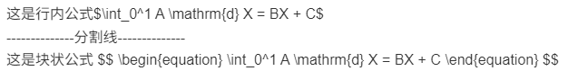
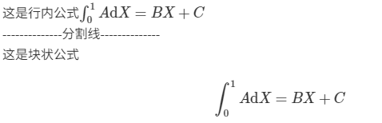

$\,$

# 概述

我们在日常书写笔记的时候经常需要插入图片，使用Markdown语言插入图片的语法如下所示。
```markdoen

```

比如下面例子(图片来自网络)：
```markdown

```

效果如下(图片来自网络)：


但Markdown原生语言插入图片时默认左对齐，无法居中显示，并且无法设置图片的样式(比如图片大小)，所以需要使用HTML语言实现图片的居中显示，语法如下所示。
```html
<div align="center">
    
</div>
```

比如可以使用下面的HTML代码将图片缩小然后居中显示：
```html
<div align="center">
    
</div>
```

虽然解决了图片居中的问题，但随之而来的问题是Hexo主题无法渲染HTML语法，导致上传到个人博客后无法正常显示图片，出现如下的结果：
<div align="center">
    
</div>

因此本笔记记录的是如何才能使Hexo能够正常渲染HTML语言。

# Hexo渲染HTML语言

其实方法很简单，只需要在HTML语言的代码块前后加上如下的模板标签即可。
```markdown

HTML代码块

```

比如下面的例子：
```markdown

<div align="center">
    
</div>

```

效果如下所示：

<div align="center">
    
</div>


并且，这种方法还支持Hexo渲染HTML代码时同时渲染代码块中的LaTex公式，比如下面的例子：
```markdown

<div align="center">
    <div>
        这是行内公式$\int_0^1 A \mathrm{d} X = BX + C$
    </div>
    <div>--------------分割线--------------</div>
    <div>
        这是块状公式
        $$
        \begin{equation}
            \int_0^1 A \mathrm{d} X = AX + C
        \end{equation}
        $$
    </div>
</div>

```

效果如下所示：

<div>
    <div>
        这是行内公式$\int_0^1 A \mathrm{d} X = AX + C$
    </div>
    <div>--------------分割线--------------</div>
    <div>
        这是块状公式
        $$
        \begin{equation}
            \int_0^1 A \mathrm{d} X = AX + C
        \end{equation}
        $$
    </div>
</div>



# VS Code中渲染HTML代码中的LaTex公式

这部分内容与Hexo渲染HTML其实没有关系，只是我在本地书写笔记时通常会使用VS Code配合Markdown Preview Enhance扩展包进行，在经历上面所讲的过程之后导致VS Code中出现一些不预期的问题，所以在这里继续记录。

我在VS Code中书写Markdown文档时，通常会使用Markdown Preview Enhance扩展包实时渲染Markdown文档。Markdown Preview Enhance扩展包虽然默认可以渲染HTML语言，但当HTML代码块中出现LaText公式时就会出现以下的问题。

## 无法渲染HTML中LaTex公式的问题

Markdown Preview Enhance扩展包无法渲染HTML代码块中的LaTex公式，如下图所示：

<div align="center">
    
</div>


此时，在VS Code的setting.json中加入如下的配置项即可，即将渲染引擎切换为MathJax。
```json
"markdown-preview-enhanced.mathRenderingOption": "MathJax"
```

配置结束后即可成功的渲染HTML代码块中的LaTex公式了，效果如下图所示。

<div align="center">
    
</div>


## HTML中LaTex公式无法渲染的特殊情况

使用上一小节的方法可以让Markdown Preview Enhance扩展包渲染HTML中的LaTex公式，但当当前Markdown文档 **只有HTML代码** 时，渲染会失效。导致这样的现象的原因是 **MPE的延迟加载机制** 。简而言之，MPE只在检测到LaTex数学公式时才会加载MathJax/Katex引擎，当文档中只有HTML时，MPE不会触发数学引擎初始化，因此导致渲染失效。

此时，只需要在当前文档开头加上一个隐藏的公式触发MPE渲染即可。
```markdown
$\,$
```

比如下面的例子：
```markdown
<!-- 隐藏的公式 -->
$\,$

<!-- HTML代码块 -->

<div>
    <div>
        这是行内公式$\int_0^1 A \mathrm{d} X = BX + C$
    </div>
    <div>--------------分割线--------------</div>
    <div>
        这是块状公式
        $$
        \begin{equation}
            \int_0^1 A \mathrm{d} X = BX + C
        \end{equation}
        $$
    </div>
</div>

```

## VS Code中公式自动编号的问题


上面讲到，为了解决HTML中LaTex公式渲染的问题，于是加上了如下的配置项。
```json
"markdown-preview-enhanced.mathRenderingOption": "MathJax"
```

但加上此设置项后，本地Markdown Preview Enhance扩展包渲染的Markdown文档中的公式自动编号功能会失效(但并不影响Hexo个人博客上的公式自动编号功能)。

目前，如何解决这个问题的方法还没找到。但可以使用自定义公式编号的方法弥补这个问题，只需要加上`\tag{}`即可，如以下代码所示。
```markdown
\begin{equation} \tag{1000}
    \int_0^1 A \mathrm{d} X = BX + C
\end{equation}
```

效果如下：
$$
\begin{equation} \tag{1000}
    \int_0^1 A \mathrm{d} X = BX + C
\end{equation}
$$