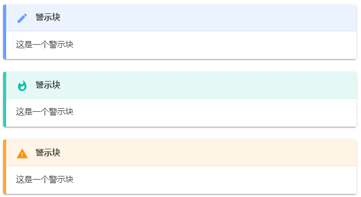

# 概述

Hexo警示块是指让Hexo博客能够支持渲染Markdown中的警示块功能，如下图所示。



# 安装步骤

## 安装hexo-admonition插件

第一步是安装Hexo内容辅助插件`hexo-admonition`，安装命令如下：
```bash
npm install hexo-admonition --save
```

## 配置样式

### 配置css样式

首先，我们先在`source/`目录下新建文件夹`css`，然后在`css`文件夹下新建`css样式文件`，可以命名为`admonition.css`。
其次，将下述代码放到`admonition.css`中，当然，可以修改代码中的参数来定制自己想要的样式。
```css
.admonition {
    margin: 1.5625em 0;
    padding: .6rem;
    overflow: hidden;
    font-size: 1rem;
    page-break-inside: avoid;
    border-left: .3rem solid #42b983;
    border-radius: .3rem;
    box-shadow: 0 0.1rem 0.4rem rgba(0,0,0,.05), 0 0 0.05rem rgba(0,0,0,.1);
    background-color: #fafafa;
  }
  
  p.admonition-title {
    position: relative;
    margin: -.6rem -.6rem .8em -.6rem !important;
    padding: .4rem .6rem .4rem 2.5rem;
    font-weight: 700;
    background-color:rgba(66, 185, 131, .1);
  }
  
  .admonition-title::before {
    position: absolute;
    top: .9rem;
    left: 1rem;
    width: 12px;
    height: 12px;
    background-color: #42b983;
    border-radius: 50%;
    content: ' ';
  }
  
  .info>.admonition-title, .todo>.admonition-title {
    background-color: rgba(0,184,212,.1);
  }
  
  .warning>.admonition-title, .attention>.admonition-title, .caution>.admonition-title {
    background-color: rgba(255,145,0,.1);
  }
  
  .failure>.admonition-title, .missing>.admonition-title, .fail>.admonition-title, .error>.admonition-title {
    background-color: rgba(255,82,82,.1);
  }
  
  .admonition.info, .admonition.todo {
    border-color: #00b8d4;
  }
  
  .admonition.warning, .admonition.attention, .admonition.caution {
    border-color: #ff9100;
  }
  
  .admonition.failure, .admonition.missing, .admonition.fail, .admonition.error {
    border-color: #ff5252;
  }
  
  .info>.admonition-title::before, .todo>.admonition-title::before {
    background-color: #00b8d4;
    border-radius: 50%;
  }
  
  .warning>.admonition-title::before, .attention>.admonition-title::before, .caution>.admonition-title::before {
    background-color: #ff9100;
    border-radius: 50%;
  }
  
  .failure>.admonition-title::before,.missing>.admonition-title::before,.fail>.admonition-title::before,.error>.admonition-title::before{
    background-color: #ff5252;;
    border-radius: 50%;
  }
  
  .admonition>:last-child {
    margin-bottom: 0 !important;
  }
```

### 配置keep.yml文件

配置css样式之后还不能被直接使用，需要在`source/_data/keep.yml`中配置之后才可被真正使用。从`keep.yml`中找到如下代码：
```yml
inject:
  enable: true  # Option values: true | false
  css:
    - /css/admonition.css
      # e.g.
      # - /css/custom-1.css
      # - /css/custom-2.css
    # - ...
  js:
    -
      # e.g.
      # - /js/custom-1.js
      # - /js/custom-2.js
    # - ...
```
在`css`那一栏填上`- /css/admonition.css`，这一步表示将样式添加到主体中。

## 清理Hexo缓存及生成静态文件

因为`keep.yml`被改动，所以保险起见还需要重新清理Hexo缓存及生成静态文件，使用如下2条命令即可。
```bash
hexo clean
hexo g
```
到这里，博客应该就可以渲染Markdown警示块的效果了。

# 警示块Markdown语法

警示块的Markdown语法如下样例所示：
```markdown
!!! note 警示块标题
    这是一个警示块
```

!!! note 警示块标题
    这是一个警示块

---

```markdown
!!! warning 警示块标题
    这是一个警示块
```

!!! warning 警示块标题
    这是一个警示块

---

```markdown
!!! error 警示块标题
    这是一个警示块
```

!!! error 警示块标题
    这是一个没有标题的警示块

---

```markdown
!!! warning ""
    这是一个没有标题的警示块
```

!!! warning ""
    这是一个没有标题的警示块

---

还有一些其他的警示块类型可以看[reStructuredText Directives](https://docutils.sourceforge.io/docs/ref/rst/directives.html)进行查看。

这里需要注意的是，为了让警示块能够尽可能的正常显示，警示块部分前后最好有空行，否则可能会失效。