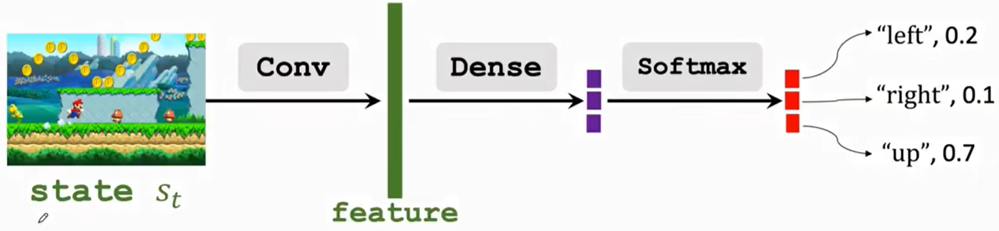

# 概述

在[《强化学习：基础篇（一）》](https://tao-oooo.github.io/%E5%BC%BA%E5%8C%96%E5%AD%A6%E4%B9%A0%EF%BC%9A%E5%9F%BA%E7%A1%80%E7%AF%87%EF%BC%88%E4%B8%80%EF%BC%89/index.html)中讲到，强化学习算法可以从2个方向出发，一是找到一个好的Policy，二是找到一个好的价值函数。在[《强化学习：基础篇（二）》](https://tao-oooo.github.io/%E5%BC%BA%E5%8C%96%E5%AD%A6%E4%B9%A0%EF%BC%9A%E5%9F%BA%E7%A1%80%E7%AF%87%EF%BC%88%E4%BA%8C%EF%BC%89/index.html)中讲了第二种方法的典型算法DQN。所以本文的内容来讲第一种方法：基于策略的强化学习。

# 基于策略的强化学习(Policy-based Reinforcement Learning)

本文主要记录的内容是Policy-based RL中的经典算法Policy Gradient算法，并且仍然会从建模和训练两个方面来描述。

## 策略梯度算法(Policy Gradient)

在[《强化学习：基础篇（二）》](https://tao-oooo.github.io/%E5%BC%BA%E5%8C%96%E5%AD%A6%E4%B9%A0%EF%BC%9A%E5%9F%BA%E7%A1%80%E7%AF%87%EF%BC%88%E4%BA%8C%EF%BC%89/index.html)中讲到，DQN算法使用神经网络对价值函数$Q^{\star} (s, a)$进行近似。同理，在Policy Gradient算法中，我们同样使用神经网络来近似，只是这次对Policy进行近似。简单来说，也就是通过Agent与环境交互学习一个好的Policy Network。

### 建模

回顾[《强化学习：基础篇（一）》](https://tao-oooo.github.io/%E5%BC%BA%E5%8C%96%E5%AD%A6%E4%B9%A0%EF%BC%9A%E5%9F%BA%E7%A1%80%E7%AF%87%EF%BC%88%E4%B8%80%EF%BC%89/index.html)，Policy是一个概率密度函数$\pi (a | s)$，函数输入是当前状态$s$，输出是关于动作的概率分布。比如游戏角色可以执行的动作空间为$\{ \text{left}，\text{right}，\text{up} \}$, $\pi (\text{left} | s) = 0.2$表示在状态$s$情况下角色往左走的概率是0.2，$\pi (\text{right} | s) = 0.1$表示在状态$s$情况下角色往右走的概率是0.1，$\pi (\text{up} | s) = 0.7$表示在状态$s$情况下角色往上走的概率是0.7。

假如Agent与环境交互过程中只有5个状态、10个动作，那么只需将所有的50个$(s, a)$二元组的概率依次计算出来即可，但实际情况中$(s, a)$二元组的情况往往无法完全穷尽，所以这时就使用神经网络来近以Policy，这样的网络就被称为Police Network。

下图是一个Policy Network的例子。这是一个有限动作空间的案例，模型输入当前的游戏画面$s_t$，通过Policy Network输出3个动作的概率，Agent根据这3个动作的概率进行采样执行，不断的与环境进行交互。

||
|:-:|
|`Conv`、`Dense`和`Softmax`组成Policy Network|

### 训练

同样的，在训练Policy Network之前，我们仍然需要先设定某个训练目标。我们无法直接对Policy Network进行训练，因为我们没有每个状态需要执行哪个动作的标准答案。这里需要借助状态价值函数(State-Value Function)的力量来训练Policy Network，这种方法就被称为策略梯度算法(Policy Gradient)[1]。

回顾[《强化学习：基础篇（一）》](https://tao-oooo.github.io/%E5%BC%BA%E5%8C%96%E5%AD%A6%E4%B9%A0%EF%BC%9A%E5%9F%BA%E7%A1%80%E7%AF%87%EF%BC%88%E4%B8%80%EF%BC%89/index.html)可以知道，状态价值函数为：
$$
\begin{equation}
    V_{\pi}(s_t) = \mathbb{E}_A [Q_{\pi}(s_t, A)] = \sum_a \pi (a | s_t) Q_{\pi}(s_t, a)
\end{equation}
$$
假如公式中的动作$A$为连续动作空间，则求和需要改为积分，即$V_{\pi}(s_t) = \mathbb{E}_A [Q_{\pi}(s_t, A)] = \int_a \pi (a | s_t) Q_{\pi}(s_t, a) \text{d}a$。

因为在建模时已经将Policy使用Policy Network近似。因此，上式中$\pi(a|s_t)$可以表示为$\pi(a|s_t; \boldsymbol{W})$。于是，状态价值函数变成了$V_{\pi}(s_t; \boldsymbol{W})$。其中，$\boldsymbol{W}$即为Policy Network的参数。重写状态价值函数即为：
$$
\begin{equation}
    V_{\pi}(s_t; \boldsymbol{W}) = \mathbb{E}_A [Q_{\pi}(s_t, A)] = \sum_a \pi (a | s_t; \boldsymbol{W}) Q_{\pi}(s_t, a)
\end{equation}
$$

因为状态价值函数可以衡量当前状态的胜算，所以我们希望当前状态下状态价值函数可以更大，这样就可以增加Agent的胜算。因此，Policy Gradient Learning的思想就是最大化状态价值函数。也就是可以设定训练目标为:
$$
\begin{equation}
    J(\boldsymbol{W}) = \mathbb{E}_S [V(S; \boldsymbol{W})]
\end{equation}
$$

上式中通过对状态$S$进行期望运算有2个含义：

* 消除来自状态$S$的随机性，使得$J(\boldsymbol{W})$越大代表Policy的平均胜算越高。
* 使目标函数$J(\boldsymbol{W})$只与Policy Network的参数$\boldsymbol{W}$有关。

最后，Policy Gradient的训练过程如下:

1) Agent观察到状态$s$
2) 使用随机梯度上升更新网络参数
$$
\begin{equation}
    \boldsymbol{W} = \boldsymbol{W} + \beta \frac{\partial V(s; \boldsymbol{W})}{\partial \boldsymbol{W}}
\end{equation}
$$

其中，$\frac{\partial V(s; \boldsymbol{W})}{\partial \boldsymbol{W}}$这一项被称为Policy Gradient。这里需要注意的是，实际训练中并没有使用$J(\boldsymbol{W})$的梯度，而是使用了状态$s$时的状态价值函数的梯度。原因是$J(\boldsymbol{W})$的梯度本身很难显式计算，而随机梯度上升算法也允许使用随机采样的样本进行优化。

接下来需要推导Policy Gradient的计算过程，以下是不严谨的推导过程：

根据状态价值函数的公式可得
$$
\begin{equation} \notag
    \begin{aligned}
        \frac{\partial V(s; \boldsymbol{W})}{\partial \boldsymbol{W}} &= \underbrace{\frac{\textcolor{red}{\partial \sum_a} \pi (a | s; \boldsymbol{W}) Q_{\pi} (s, a)}{\partial \boldsymbol{W}}}_{\text{红色部分偏微分和求和符号可以交换}} \\
        &= \underbrace{\sum_a \frac{\partial \pi (a | s; \boldsymbol{W}) \textcolor{red}{Q_{\pi} (s, a)}}{\partial \boldsymbol{W}}}_{\text{假设红色部分与$\boldsymbol{W}$无关}} \\
        &= \underbrace{\sum_a \frac{\partial \pi (a | s; \boldsymbol{W})}{\partial \boldsymbol{W}} Q_{\pi} (s, a)}_{将这个式子称为\text{Form 1}} \\
        &= \underbrace{\textcolor{red}{\sum_a \pi (a | s; \boldsymbol{W})} \textcolor{blue}{\frac{\partial \log \pi (a | s; \boldsymbol{W})}{\partial \boldsymbol{W}}} Q_{\pi} (s, a)}_{红色这一项的形式是基于动作概率分布的期望展开式} \\
        &= \underbrace{\mathbb{E}_A \left[ \frac{\partial \log \pi (a | s; \boldsymbol{W})}{\partial \boldsymbol{W}} Q_{\pi} (s, a) \right]}_{将这个式子称为\text{Form 2}}
    \end{aligned}
\end{equation}
$$

上面推导过程中将偏导数转化为对数偏导数的方法是常用的手段之一，我们很容易就可以推导出等式$\frac{\partial \pi (a | s; \boldsymbol{W})}{\partial \boldsymbol{W}} = \textcolor{red}{\pi (a | s; \boldsymbol{W})} \textcolor{blue}{\frac{\partial \log \pi (a | s; \boldsymbol{W})}{\partial \boldsymbol{W}}}$。另外，$Q_{\pi} (s, a)$这一项实际上也需要求导，这里忽略了，但并不影响结果。

最后，上面推导中的Form 1和Form 2可以根据不同的情况作为Policy Gradient的计算方法。

* 如果动作空间为 **离散动作空间** ，比如$A = \{\text{left}, \text{right}, \text{up}\}$，则可以使用Form 1计算
  * 枚举每个动作$a$，分别计算对应的$f(a, \boldsymbol{W}) = \frac{\partial \pi (a | s; \boldsymbol{W})}{\partial \boldsymbol{W}} Q_{\pi} (s, a)$
  * 计算Policy Gradient $\frac{\partial V(s; \boldsymbol{W})}{\partial \boldsymbol{W}} = f(\text{left}, \boldsymbol{W}) + f(\text{right}, \boldsymbol{W}) + f(\text{up}, \boldsymbol{W})$
* 如果动作空间为 **连续动作空间** ，则无法使用Form 1，只能使用Form 2。但计算期望需要进行积分运算，而对于复杂的神经网络而言无法显式计算，此时需要使用蒙特卡洛近似方法。在实际中就是采样多个样本，使用这些样本近似期望。这里直接采样一个样本进行近似：
  * 观测到状态$s$
  * 根据状态$s$从Policy Network的输出中随机采样一个动作，即$\hat{a} \sim \pi (\cdot | s; \boldsymbol{W})$
  * 使用$\hat{a}$计算$g(\hat{a}, \boldsymbol{W}) = \frac{\partial \log \pi (\hat{a} | s; \boldsymbol{W})}{\partial \boldsymbol{W}} Q_{\pi} (s, \hat{a})$
  * 使用$g(\hat{a}, \boldsymbol{W})$近似Policy Gradient $\frac{\partial V(s; \boldsymbol{W})}{\partial \boldsymbol{W}}$

除此之外，Policy Gradient中还有一个问题需要解决，那就是$Q_{\pi} (s, \hat{a})$的计算。但我们并不知道Q-Value Function，无法直接计算。通常有两种方法可以近似得到状态动作价值：

* REINFORCE
  * 第一步记录Agent与环境互动的整个轨迹 $s_1, a_1, r_1, s_2, a_2, r_2, \cdots, s_T, a_T, r_T$
  * 第二步计算折扣回报 $u_t = \sum_{k = t}^T \gamma^{k - t} r_k$
  因为$Q_{\pi} (s_t, a_t) = \mathbb{E} [U_t]$，所以可以使用$u_t$近似$Q_{\pi} (s_t, a_t)$，即$q_t = u_t$

* 使用神经网络近似$Q_{\pi}$
  * 这种方法衍生出了Actor-Critic方法

# 参考文献

笔记内容整理自《Shusen Wang, Yujun Li, and Zhihua Zhang. Deep Reinforcement Learning. Posts and Telecom Press Co., Ltd, 2022.》

[1] Policy Gradient Methods for Reinforcement Learning with Function Approximation