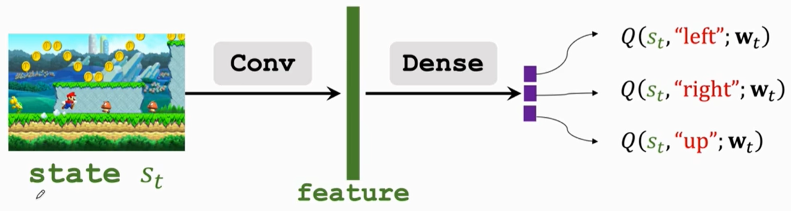
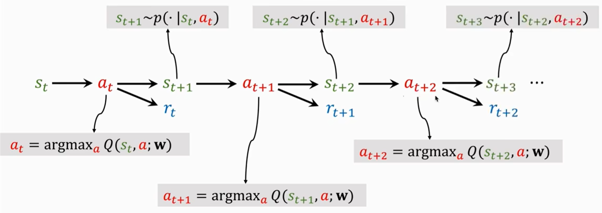

# 概述

在[《强化学习：基础篇（一）》](https://tao-oooo.github.io/%E5%BC%BA%E5%8C%96%E5%AD%A6%E4%B9%A0%EF%BC%9A%E5%9F%BA%E7%A1%80%E7%AF%87%EF%BC%88%E4%B8%80%EF%BC%89/index.html)中讲到，强化学习算法可以从2个方向出发：

* 方向一：直接找出一个好的Policy $\pi (a | s)$，输入状态$s_t$，然后从$a_t \sim \pi (\cdot | s_t)$中随机采样一个动作，这种方法称为Policy-based方法。
* 方向二：直接找出一个最优动作价值函数$Q^{\star} (s_t, a_t)$，输入状态$s_t$，然后根据动作价值函数的打分选择动作，即$a_t = \text{arg max}_a Q^{\star} (s_t, a_t)$，这种方法称为Value-based方法。

本笔记的内容记录了Value-based方法中的DQN算法。

# 基于价值的强化学习(Value-based Reinforcement Learning)

Value-based RL基于最优动作价值函数$Q^* (s_t, a_t)$选择在状态$s_t$时需要采用哪个动作。

## DQN(Deep Q-Network)

DQN是Value-based RL中的经典算法，下面从建模和训练两个方面记录DQN算法。

### 建模

因为我们需要根据$a = \text{argmax}_a Q^{\star} (s, a)$来选择Agent需要执行的动作，所以我们需要先有最优价值函数$Q^{\star} (s, a)$。但我们实际上并没有$Q^{\star} (s, a)$，而神经网络可以用来近似各种各样的函数，所以DQN算法就是使用神经网络来近似$Q^{\star} (s, a)$。我们将神经网络记为$Q(s, a; \boldsymbol{W})$，DQN就是使用$Q(s, a; \boldsymbol{W})$近似$Q^{\star} (s, a)$，其中$\boldsymbol{W}$表示神经网络的参数。

以下图的超级玛丽游戏为例，Agent的动作只能选择$\{ \text{left}, \text{right}, \text{up} \}$，所以动作空间为离散动作空间。图中`Conv`和`Dense`部分就是神经网络，网络的输入为状态$s_t$，也就是游戏当前画面；网络输出为3个动作对应的价值。最后，Agent根据神经网络给出的3个动作的价值进行选择。

||
|:-:|

Agent经过不停的与环境交互，每一轮游戏结束后就会生成下图所示的完整轨迹。

||
|:-:|

通过Agent的轨迹可以对神经网络进行训练。

### 训练

有了神经网络和Agent生成的轨迹之后就可以开始对网络进行训练。神经网络训练需要目标函数，在DQN算法中使用时序差分学习(Temporal Diference Leamning, TD)算法[1][2]。从直觉上来说，我们只能在游戏结束后才能知道当局游戏的胜负或得分大小，进而得知当前的价值函数$Q^{\star} (s, a)$是否是最好的。但有些场景下Agent跑完整个轨迹可能需要很长的时间，甚至是无限长时间，以至于我们根本无法获取完整的Agent轨迹。而TD算法的核心是我们并不需要让Agent跑完整个轨迹同样可以更新网络参数。

在[《强化学习：基础篇（一）》](https://tao-oooo.github.io/%E5%BC%BA%E5%8C%96%E5%AD%A6%E4%B9%A0%EF%BC%9A%E5%9F%BA%E7%A1%80%E7%AF%87%EF%BC%88%E4%B8%80%EF%BC%89/index.html)中讲到，价值函数是当前时刻$t$开始的Discounted Return的期望。假设Q-Network近似的价值函数已经很准，那么Q-Network应该满足这样的关系：也就是 **$t$时刻开始的Return** 就是 **$t$时刻观测的真实Reward** 与 **$t + 1$时刻开始的Return** 的 **总和** 。因此，TD算法的核心即下式所示：
$$
\begin{equation}
  Q(s_t, a_t; \boldsymbol{W}) \approx r_t + \gamma Q(s_{t + 1}, a_{t + 1}; \boldsymbol{W})
\end{equation}
$$
其中，$Q(s_t, a_t; \boldsymbol{W})$表示$t$时刻Q-Network估计的价值($t$时刻开始的Discounted Return)，$Q(s_{t + 1}, a_{t + 1}; \boldsymbol{W})$表示$t + 1$时刻Q-Network估计的价值($t + 1$时刻开始的Discounted Return)，$r_t$表示$t$时刻观测到奖励值。

下面是式(1)的不严谨推导过程。
从Discounted Return的定义可以有式(2)的推导。
$$
\begin{equation}
  \begin{aligned}
      U_t &= R_t + \gamma R_{t + 1} + \gamma^2 R_{t + 2} + \gamma^3 R_{t + 3} + \gamma^4 R_{t + 4} + \cdots \\
      &= R_t + \gamma (R_{t + 1} + \gamma R_{t + 2} + \gamma^2 R_{t + 3} + \gamma^3 R_{t + 4} + \cdots) \\
      &= R_t + \gamma U_{t + 1}
  \end{aligned}
\end{equation}
$$
也就是$U_t = R_t + \gamma U_{t + 1}$。
DQN的设计表明，$t$时刻DQN的输出$Q(s_t, a_t; \boldsymbol{W})$是$\mathbb{E}[U_t]$的估计，$t + 1$时刻DQN的输出$Q(s_{t + 1}, a_{t + 1}; \boldsymbol{W})$是$\mathbb{E}[U_{t + 1}]$的估计。因此可以将式(2)变成式(3)，同时等号变为约等号。
$$
\begin{equation}
  \underbrace{Q(s_t, a_t; \boldsymbol{W})}_{\approx \mathbb{E}[U_t]} \approx \mathbb{E}[R_t + \gamma \underbrace{Q(S_{t + 1}, A_{t + 1}; \boldsymbol{W})}_{\approx \mathbb{E}[U_{t + 1}]}]
\end{equation}
$$
式中，约等号左边部分是DQN估计的$t$时刻的Q-Value，约等号右边的$Q(S_{t + 1}, A_{t + 1}; \boldsymbol{W})$是DQN估计的$t + 1$时刻的Q-Value。模型跑到$t$时刻时，产生State和Action的观测值，所以$s_t$和$a_t$用小写字母表示。而因为$t + 1$时刻还未发生，所以$R_t$、$S_{t + 1}$和$A_{t + 1}$都是随机变量，用大写字母表示。所以对约等号右侧整体取期望的目的是消除随机性。

当到达$t + 1$时刻后，得到观测值$r_t$和$s_{t + 1}$。根据$s_{t + 1}$可以得到$t + 1$时刻的最优动作$a_{t + 1}$，则进一步可以得到：
$$
\begin{equation}
  \underbrace{Q(s_t, a_t; \boldsymbol{W})}_{\text{Predict}} \approx \underbrace{r_t + \gamma Q(s_{t + 1}, a_{t + 1}; \boldsymbol{W})}_{\text{TD Target}}
\end{equation}
$$
有了Predict和TD Target之后就可以对DQN进行训练。TD算法中将Predict和TD Target之间的差值称为TD Error，DQN的训练目标就是使得TD Error更小。换句话说，降低TD Error的目的也就是让Predict与TD Target之间尽量接近。这个训练目标背后的思想是TD Target相比于Predict而言会更可信，因为TD Target中包含了真实的奖励$r_t$，而Predict只是神经网络的近似值，TD算法希望两次Q-Value预测值之间的差值尽可能的接近真实奖励。

最后总结一下整个TD算法的过程：

1. 第一步预测$Q(s_t, a_t; \boldsymbol{W}_t)$：Agent到$t$时刻得到观测值$s_t$，使用DQN对不同动作进行打分(对于离散动作空间而言，每个动作都会对应一个Q-Value)，从而获得最优动作$a_t$，也就得到了$Q(s_t, a_t; \boldsymbol{W}_t)$。
2. 第二步计算TD Error：Agent到$t + 1$时刻得到观测值$r_t$和$s_{t + 1}$，根据$s_{t + 1}$再次对每个动作打分，并得到最优动作$a_{t + 1}$，同时得到$Q(s_{t + 1}, a_{t + 1}; \boldsymbol{W}_t)$，然后计算TD Target $y_t$
$$
\begin{equation}
  \begin{aligned}
    y_t &= r_t + \gamma Q(s_{t + 1}, a_{t + 1}; \boldsymbol{W}_t) \\
    &= r_t + \gamma \textcolor{red}{\max_a Q(s_{t + 1}, a_{t + 1}; \boldsymbol{W}_t)}
  \end{aligned}
\end{equation}
$$
其中红色部分就是根据$s_{t + 1}$使用DQN再次打分得到最优动作$a_{t + 1}$的过程。这里需要注意的是，在DQN中这一次选择最优动作仅仅只是为了计算TD Target，Agent实际上并没有真的采用$a_{t + 1}$与环境交互。
1. 第三步计算Loss
$$
\begin{equation}
  L_t = \frac{1}{2} \left[ Q(s_t, a_t; \boldsymbol{W}_t) - y_t \right]^2
\end{equation}
$$
1. 第四步使用梯度下降算法训练DQN网络
$$
\begin{equation}
  \boldsymbol{W}_{t + 1} = \boldsymbol{W}_t - \alpha \left. \frac{\partial L_t}{\partial \boldsymbol{W}} \right|_{\boldsymbol{W} = \boldsymbol{W}_{t}}
\end{equation}
$$

# 参考文献

笔记内容整理自《Shusen Wang, Yujun Li, and Zhihua Zhang. Deep Reinforcement Learning. Posts and Telecom Press Co., Ltd, 2022.》

[1] A Convergent $O(n)$ Temporal-difference Algorithm for Off-policy Learning with Linear Function Approximation

[2] Fast Gradient-Descent Methods for Temporal-Difference Learning with Linear Function Approximation