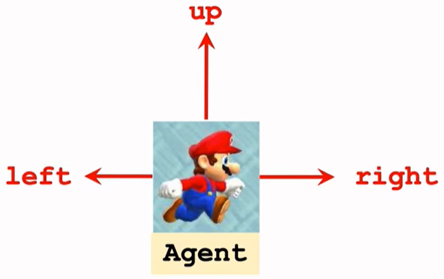
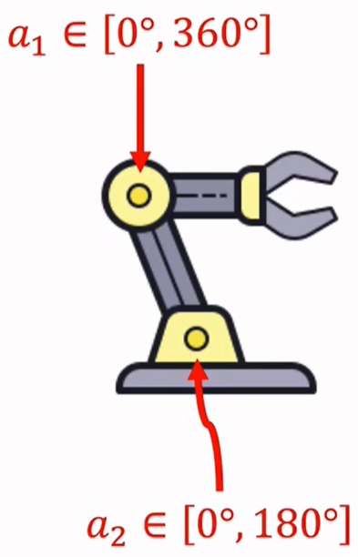
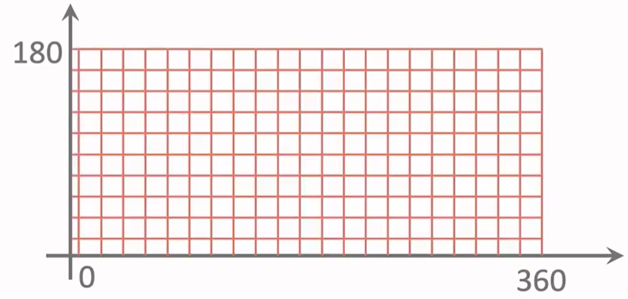
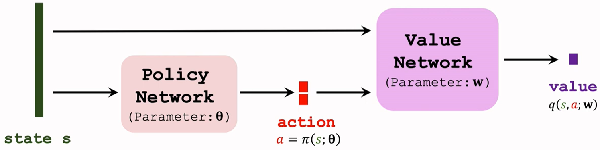

# 离散控制和连续控制

[《强化学习：基础篇（二）》](https://tao-oooo.github.io/%E5%BC%BA%E5%8C%96%E5%AD%A6%E4%B9%A0%EF%BC%9A%E5%9F%BA%E7%A1%80%E7%AF%87%EF%BC%88%E4%BA%8C%EF%BC%89/index.html)、[《强化学习：基础篇（三）》](https://tao-oooo.github.io/%E5%BC%BA%E5%8C%96%E5%AD%A6%E4%B9%A0%EF%BC%9A%E5%9F%BA%E7%A1%80%E7%AF%87%EF%BC%88%E4%B8%89%EF%BC%89/index.html)和[《强化学习：基础篇（四）》](https://tao-oooo.github.io/%E5%BC%BA%E5%8C%96%E5%AD%A6%E4%B9%A0%EF%BC%9A%E5%9F%BA%E7%A1%80%E7%AF%87%EF%BC%88%E5%9B%9B%EF%BC%89/index.html)中涉及到的都是离散控制问题，即Agent的动作空间是离散动作空间。比如下图中的马里奥在游戏中只有3种动作可以执行，所以马里奥的动作空间为$\mathcal{A} = \{\text{left}, \text{right}, \text{up}\}$。

||
|:-:|
|动作空间中只有3个动作|

而现实中Agent的动作空间往往是连续的，这就是连续控制问题，比如下图中的机械臂控制：

||
|:-:|
|$(a_1, a_2)$二元组表示机械臂的动作，但$a_1, a_2$是有限范围内的实数|

机械臂关节的动作空间为 $\mathcal{A} = [0^{\circ}, 360^{\circ}] \times [0^{\circ}, 180^{\circ}]$，它是 2-dim 连续动作空间。

针对连续控制问题，无法直接套用离散控制所用的方法，因为我们无法让神经网络的输出层变成无限维。最简单的一个解决方法是对连续动作空间进行离散化，如此便能继续套用离散控制所用的方法。以上面机械臂为例，可以将动作空间进行网格化，如下图所示：

||
|:-:|
|每个网格代表一个动作|

但这种方法有很大的缺陷：

* 离散化后的动作丢失了精度，精度的高低取决于网格的大小
* 离散化越精细，切分后的动作越多，最终导致维度灾难(Curse of Dimensionality)。同时，切分后网格的数量与空间维度$d$密切相关，$d$不断增加也会导致网格个数呈指数增长

# 确定性策略梯度(Deterministic Policy Gradient, DPG)

DPG[1][2]是一种可以用于连续动作空间的方法。DPG最早在2014年被提出，在2016年被应用于神经网络上，被称为DDPG。DPG是一种Actor-Critic方法，因此由Policy Network和Value Network两个网络组成，如下图所示。

||
|:-:|
|与Actor-Critic不一样，不再是分立网络|

与之前讲的Actor-Critic方法不一样的地方是：这里Policy Network的输出是一个确定性的动作$a = \pi(s; \theta)$，而不再是一个动作分布，因此被称为确定性策略网络(Deterministic Policy Network)。Policy Network给出的动作直接作为Value Network的输入，最终Value Network输出一个实数$q(s, a; w)$，代表对动作的评分。

与Actor-Critic算法一样，训练时Actor和Critic两者交互进行参数更新。首先训练Value Network，训练过程如下：

* 观察到Transition $(s_t, a_t, r_t, s_{t+1})$
* 使用价值网络预测$t$时刻动作$a_t$在状态$s_t$时的价值
$$
q_t = q(s_t, a_t; w)
$$
* 使用价值网络预测$t + 1$时刻做出动作的价值
$$
a_{t+1}^{\prime} = \pi(s_{t+1}; \theta) \\
q_{t+1} = q(s_{t+1}, a_{t+1}^{\prime}; w)
$$
* 计算 TD Error
$$
\delta_t = q_t - \left(r_t + \gamma q_{t+1}\right)
$$
* 更新网络参数
$$
w \leftarrow w - \alpha \delta_t \frac{\partial q(s_t, a_t; w)}{\partial w}
$$

其次训练Policy Network，这里与Policy Gradient中的思想一致，同样需要借助价值函数对Policy Network进行参数更新。所以训练Policy Network时需要借助Value Network对动作评分，以判断输出的动作的好坏。因此，Policy Network的目标是输出的动作能使Value Network的评分尽可能高，即目标就是最大化$q(s, a; w)$。其中，$a = \pi(s; \theta)$，同时冻结Value Network参数。于是，训练过程如下：

* 计算确定性策略梯度(DPG)
$$
g = \frac{\partial q(s, \pi(s; \theta); w)}{\partial \theta} = \frac{\partial a}{\partial \theta} \frac{\partial q(s, a; w)}{\partial a}
$$
* 使用梯度上升(Gradient Ascent)更新Policy Network的参数
$$
\theta \leftarrow \theta + \beta g
$$

这里需要注意的是，实际上使用上面的方法训练Value Network的效果并不是最好的，可以使用Target Network来改进。在说明Target Network之前再次回顾Value Network的训练过程：

* 首先会预测$t$时刻的价值$q_t = q(s_t, a_t; w)$
* 其次会预测$t + 1$时刻的价值$q_{t+1} = q(s_{t+1}, a_{t+1}^{\prime}; w)$，其中$a_{t+1}^{\prime} = \pi(s_{t+1}; \theta)$
* 于是有TD Error $\delta_t = q_t - \left(r_t + \gamma q_{t+1}\right)$

这里使用$\left(r_t + \gamma q_{t+1}\right)$作为TD Target会产生Over-estimate或Under-estimate的问题，所以使用另一个神经网络来近似TD Target，这个网络就称为Target Network。

于是上面训练过程中第二步可以改进为：

* 预测$t + 1$时刻的价值$q_{t+1} = q(s_{t+1}, a_{t+1}^{\prime}; w^{-})$，其中$a_{t+1}^{\prime} = \pi(s_{t+1}; \theta^{-})$。这里$\pi(s_{t+1}; \theta^{-})$来自于Target Policy Network，$q(s_{t+1}, a_{t+1}^{\prime}; w^{-})$来自于Target Value Network。这两个网络与Value Network和Policy Network同结构不同参数。

总结来说，整个训练过程为：

* Policy Network决策：$a = \pi(s; \theta)$
* Policy Network通过DPG更新参数：$\theta \leftarrow \theta + \beta \frac{\partial a}{\partial \theta} \frac{\partial q(s, a; w)}{\partial a}$
* Value Network计算价值：$q_t = q(s, a; w)$
* Target Network $\pi(s; \theta^{-})$和$q(s, a; w^{-})$计算价值：$q_{t+1}$
* 计算TD Error：$\delta_t = q_t - \left(r_t + \gamma q_{t+1}\right)$
* Value Network通过TD更新参数：$w \leftarrow w - \alpha \delta_t \frac{\partial q(s, a; w)}{\partial w}$

除此之外，Target Network在训练过程中也需要进行参数更新，更新策略通常为：

* 设置超参数$\tau \in (0, 1)$
* 对Policy Network和Value Network的参数使用加权平均(Weighted Averaging)的方法更新Target Network参数，即
$$
w^{-} \leftarrow \tau w + (1 - \tau) w^{-} \\
\theta^{-} \leftarrow \tau \theta + (1 - \tau) \theta^{-}
$$

最后，仍然需要注意的是，这种方法虽然能增强模型性能，但还是无法从根本上解决Over-estimate或Under-estimate问题。其他提升性能的方法有：

* Experience Replay
* Multi-step TD Target

# 参考文献

笔记内容整理自《Shusen Wang, Yujun Li, and Zhihua Zhang. Deep Reinforcement Learning. Posts and Telecom Press Co., Ltd, 2022.》

[1] Silver et al. Deterministic policy gradient algorithms. In ICML, 2014.

[2] Lillicrap et al. Continuous control with deep reinforcement learning. In ICLR, 2016.