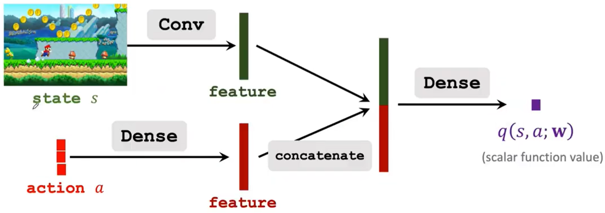

# Actor-Critic

在[《强化学习：基础篇（三）》](https://tao-oooo.github.io/%E5%BC%BA%E5%8C%96%E5%AD%A6%E4%B9%A0%EF%BC%9A%E5%9F%BA%E7%A1%80%E7%AF%87%EF%BC%88%E4%B8%89%EF%BC%89/index.html)的结尾处提到，Policy Gradient中还有一个问题需要解决，那就是$Q_{\pi} (s, \hat{a})$的计算，因为并不知道Q-Value Function，因此需要通过近似获得。其中一种近似方法就是使用神经网络近似$Q_{\pi}$，而这种方法就被称为Actor-Critic方法。所以简单来说，Actor-Critic就是结合了Policy-based和Value-based的思想。其中，Actor是策略网络，控制Agent执行动作，Critic是价值网络，用于对动作打分。

## 建模

Actor-Critic算法的建模方法很简单，就是将DQN与Policy Gradient方法结合。我们再回顾State-Value Function的内容:

$$
V_\pi(s) = \sum_a \pi(a|s) Q_\pi(s, a) \tag{1}
$$

我们可以使用一个神经网络$\pi(a|s; \theta)$估计策略$\pi(a|s)$，可以称为Policy Network；同时使用另一个神经网络$q(s, a; w)$估计动作价值函数$Q_\pi(s, a)$，可以称为Value Network。其中，$(\theta, w)$分别是两个网络的参数。

因此,可以得到如下表达式：

$$
V_\pi(s) = \sum_a \pi(a|s) Q_\pi(s, a) \approx \sum_a \pi(a|s; \theta) q(s, a; w) \tag{2}
$$

Policy Network和Value Network网络的大致结构如下图所示：

||
|:-:|
|Policy Network|

||
|:-:|
|Value Network|

## 训练

训练过程中两个网络需要同时进行训练，即：

* 对于Policy Network而言，需要更新参数$\theta$尽可能最大化状态价值函数$V(s; \theta, w)$
* 对于Value Network而言，则需要更新参数$w$使得能够更好的估计Return

因此，大致的训练过程如下：

1. $t$时刻观察到状态$s_t$
2. 根据$\pi(\cdot|s_t; \theta_t)$随机采样动作$a_t$
3. 执行动作$a_t$，观察到新状态$s_{t+1}$和奖励$r_t$
4. 使用Temporal Diference算法更新参数$w$
5. 使用Policy Gradient算法更新参数$\theta$

将上述训练过程详细展开即为:

1. 观测到状态$s_t$，随机采样动作$a_t \sim \pi(\cdot|s_t; \theta_t)$
2. 执行动作$a_t$，环境反馈新的状态$s_{t+1}$和奖励$r_t$
3. 根据新状态随机采样动作$\tilde{a}_{t+1} \sim \pi(\cdot|s_{t+1}; \theta_t)$，与DQN一样，此动作Agent并不会执行，仅仅只是用于计算TD Error
4. 根据Value Network计算$q_t = q(s_t, a_t; w_t)$和$q_{t+1} = q(s_{t+1},\tilde{a}_{t+1}; w_t)$
5. 计算TD Error：$\textcolor{blue}{\delta_t} = q_t - (r_t + \gamma q_{t+1})$
6. 对Value Network求微分：$\mathbf{d}_{w,t} = \left. \frac{\partial q(s_t, a_t; w)}{\partial w} \right|_{w = w_t}$
7. 更新Value Network参数：$w_{t+1} = w_t - \alpha \delta_t \mathbf{d}_{w,t}$
8. 对Policy Network 求微分：$\mathbf{d}_{\theta,t} = \left. \frac{\partial \log \pi(a_t|s_t; \theta)}{\partial \theta} \right|_{\theta = \theta_t}$
9. 更新Policy Network参数：$\theta_{t+1} = \theta_t - \alpha \textcolor{red}{q_t} \mathbf{d}_{\theta,t}$

这里需要注意的是，在很多文献中，第(9)步更新Policy Network参数时，$\textcolor{red}{q_t}$也会使用第(5)步中的$\textcolor{blue}{\delta_t}$。其实两种方法都是正确的，第二种方法被称为Policy Gradient with Baseline，在实作中通常方法二效果更好。

# 参考文献

笔记内容整理自《Shusen Wang, Yujun Li, and Zhihua Zhang. Deep Reinforcement Learning. Posts and Telecom Press Co., Ltd, 2022.》

[《Actor-Critic Algorithms》](https://proceedings.neurips.cc/paper/1999/file/6449f44a102fde848669bdd9eb6b76fa-Paper.pdf)
