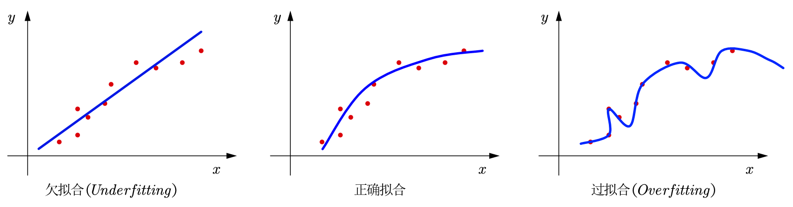

# 线性回归 (Linear Regression)

回顾线性回归的Loss Function形式：
$$
\begin{equation} \tag{1} \label{1}
    L(W) = \sum_{i=1}^N \| W x_i - y_i \|_2^2
\end{equation}
$$

通过 [《机器学习（四）：线性回归》](https://tao-oooo.github.io/%E6%9C%BA%E5%99%A8%E5%AD%A6%E4%B9%A0%EF%BC%88%E5%9B%9B%EF%BC%89%EF%BC%9A%E7%BA%BF%E6%80%A7%E5%9B%9E%E5%BD%92/index.html) 笔记中的推导可得参数$W$可以显式的表达为：

$$
\begin{equation} \tag{2} \label{2}
    \hat{W} = (X^\top X)^{-1} X^\top Y
\end{equation}
$$

其中，$X \in \mathbb{R}^{N \times p}, Y \in \mathbb{R}^N$，$N$ 为样本个数。

## 正则化

### 过拟合

在讲正则化之前，必须要提及机器学习中非常重要的一个概念：过拟合。机器学习的目的是通过给定的训练数据，找到一个足够好的模型，这个模型可以用于完成未来新数据(也可以称为是测试数据)的预测工作。简单来说，过拟合就像模型只是把训练数据全部记住了一样，如下图所示。

从Loss的角度来看，过拟合的表现是模型在训练数据上的性能很好(测试误差小)，但在测试数据上的性能很差(测试误差大)，也标志着模型不具备泛化性。通常来说，解决过拟合的方法有如下3种方法，当然也不限于这些方法：

- 增加更多的数据
- 特征选择/特征提取(PCA)
- 正则化

其中，而本笔记中的正则化就是常用的解决过拟合的一种方法。

### 正则化框架

正则化的过程通常是对需要优化的目标函数增加一些限制，如式$\eqref{3}$中的 $\textcolor{red}{\lambda P(W)}$ 项就是限制项，也可以称为正则项。

$$
\begin{equation} \tag{3} \label{3}
    \arg \min_W [ L(W) + \textcolor{red}{\lambda P(W)} ]
\end{equation}
$$

直观的理解就是在最小化目标函数的时候让参数$W$不要走得太远。

常见的正则化方法有两种：

- L1正则化：这种方法也被称为Lasso，其中$P(W)$采用模型参数$W$的一范数表示，即$P(W) = \| W \|_1$
- L2正则化：这种方法也被称为岭回归(Ridge)或者权值衰减(Weight Decay)，其中$P(W)$采用模型参数$W$的二范数表示，即$P(W) = \| W \|_2^2 = W^\top W$

### 频率角度推导正则化线性回归

在原始线性回归的基础上，可以求出正则化后的线性回归的最优解。首先对目标函数进行化简：

$$
\begin{equation} \tag{4} \label{4}
    \begin{aligned}
        J(W) &= L(W) + \lambda P(W) \\
        &= \sum_{i=1}^N \| W^\top x_i - y_i \|^2 + \lambda \| W \|_2^2 \\
        &= \textcolor{red}{\sum_{i=1}^N (W^\top x_i - y_i) (W^\top x_i - y_i)^\top} + \lambda W^\top W \\
        &= \textcolor{red}{(W X^\top - Y^\top) (X W - Y)} + \lambda W^\top W \\
        &= \textcolor{blue}{W^\top X^\top X W} - 2 W^\top X^\top Y + Y^\top Y + \textcolor{blue}{\lambda W^\top W} \\
        &= \textcolor{blue}{W^\top (X^\top X + \lambda I) W} - 2 W^\top X^\top Y + Y^\top Y
    \end{aligned}
\end{equation}
$$

其中，红色部分的推导过程可以参考 [《机器学习（四）：线性回归》](https://tao-oooo.github.io/%E6%9C%BA%E5%99%A8%E5%AD%A6%E4%B9%A0%EF%BC%88%E5%9B%9B%EF%BC%89%EF%BC%9A%E7%BA%BF%E6%80%A7%E5%9B%9E%E5%BD%92/index.html) 笔记中的(4)式。

我们需要估计的参数$W$仍然是如下式子：

$$
\begin{equation} \tag{5} \label{5}
    \hat{W} = \arg \min_W J(W)
\end{equation}
$$

接下来仍然可以使用令$\frac{\partial J(W)}{\partial W} = 0$的方法直接求解目标函数，可得：

$$
\begin{equation} \tag{6} \label{6}
    \begin{aligned}
        &\frac{\partial J(W)}{\partial W} = 2 (X^\top X + \lambda I) W - 2 X^\top Y = 0 \\
        &\implies \boxed{\hat{W} = (X^\top X + \lambda I)^{-1} X^\top Y}
    \end{aligned}
\end{equation}
$$

在上式的求导过程中，$L(W)$对$W$的导数可见 [《机器学习（四）：线性回归》](https://tao-oooo.github.io/%E6%9C%BA%E5%99%A8%E5%AD%A6%E4%B9%A0%EF%BC%88%E5%9B%9B%EF%BC%89%EF%BC%9A%E7%BA%BF%E6%80%A7%E5%9B%9E%E5%BD%92/index.html) 笔记，剩下的项即为正则化项的求导结果。为了更清晰，这里补充正则化项$\lambda W^\top W$对$W$的求导过程。

> **正则项求导过程** 
    首先先确定是什么类型的矩阵导数。因为$W$的维度为$(p \times 1)$，所以$W^\top W$是实数，所以$\frac{\partial \lambda W^\top W}{\partial W}$是标量对向量的导数，并且可以使用矩阵的迹进行辅助求导。 
    其次再确定矩阵导数的尺寸。因为这里需要求的是$W$的梯度矩阵(分母布局)，所以$\frac{\partial \lambda W^\top W}{\partial W}$的维度是$(p \times 1)$。 
    具体推导如下： 
    $$
    \begin{equation}
        \begin{aligned}
            \mathrm{d}(\lambda W^\top W) &= \mathrm{tr}(\mathrm{d}(\lambda W^\top W)) \\
            &= \mathrm{tr}(\lambda (\mathrm{d}W^\top) W + \lambda W^\top (\mathrm{d}W)) \\
            &= \lambda \mathrm{tr}(W (\mathrm{d}W^\top)) + \lambda \mathrm{tr}(W^\top (\mathrm{d}W)) \\
            &= \lambda \mathrm{tr}(W^\top (\mathrm{d}W)) + \lambda \mathrm{tr}(W^\top (\mathrm{d}W)) \\
            &= 2 \lambda \mathrm{tr}(W^\top (\mathrm{d}W))
        \end{aligned}
    \end{equation}
    $$ 
    因此，$\frac{\partial \lambda W^\top W}{\partial W}$的分子布局为$2 \lambda W^\top$。转换为分母布局(梯度矩阵)的形式即为： 
    $$
    \begin{equation}
        \frac{\partial \lambda W^\top W}{\partial W} = 2 \lambda W
    \end{equation}
    $$

从线性代数的角度来看，因为$X^\top X$不一定可逆，并且$X^\top X$半正定，所以可能会让目标函数有无穷解，增加过拟合的风险，而使用正则化后，$X^\top X + \lambda I$一定可逆，所以可以有效抑制了过拟合。

### 贝叶斯角度看待正则化线性回归

#### 先验

谈到贝叶斯，就必然会有概率分布参与其中。这里假设参数$W \in \mathbb{R}^p$和噪声$\varepsilon \in \mathbb{R}^N$的先验分布都服从高斯分布，即

$$
\begin{equation} \tag{7} \label{7}
    W \sim \mathcal{N}(0, \sigma_0^2 I_p), \varepsilon \sim \mathcal{N}(0, \sigma^2 I_N)
\end{equation}
$$

其中，$\sigma_0^2 I_p$和$\sigma^2 I_N$都是协方差矩阵，$I_p$和$I_N$分别是$(p \times p)$和$(N \times N)$的单位矩阵。

根据多元高斯分布的定义可以得到下式：

$$
\begin{equation} \tag{8} \label{8}
    \begin{aligned}
        P(W) &= \frac{1}{(2 \pi)^{\frac{p}{2}}
        \left|
            \sigma_0^2 I_p
        \right|^{\frac{1}{2}}} \exp 
        \left\{
            -\frac{1}{2} W^\top\left(\sigma_0^2 I_p\right)^{-1} W
        \right\} \\
        &= \frac{1}{(2 \pi)^{\frac{p}{2}}
        \left|
            \sigma_0^2 I_p
        \right|^{\frac{1}{2}}} \exp
        \left\{
            -\frac{1}{2 \sigma_0^2} W^\top I_p^{-1} W
        \right\} \\
        &= \underbrace{\frac{1}{(2 \pi)^{\frac{p}{2}}
        \textcolor{red}{\left| \sigma_0^2 I_p \right|^{\frac{1}{2}}}}}_{I_p的行列式值为1}
        \exp \left\{
            -\frac{\|W\|_2^2}{2 \sigma_0^2}
        \right\} \\
        &= \frac{1}{(2 \pi)^{\frac{p}{2}} \sigma_0} \exp 
        \left\{
            -\frac{\|W\|_2^2}{2 \sigma_0^2}
        \right\}
    \end{aligned}
\end{equation}
$$

因为$f(W)=X W$，并且$\varepsilon \sim \mathcal{N}\left(0, \sigma^2 I_N\right)$，所以根据 [《机器学习（三）：绪论》](https://tao-oooo.github.io/%E6%9C%BA%E5%99%A8%E5%AD%A6%E4%B9%A0%EF%BC%88%E4%B8%89%EF%BC%89%EF%BC%9A%E7%BB%AA%E8%AE%BA/index.html) 笔记中的内容，$Y \in \mathbb{R}^N$可以表达为如下形式：

$$
\begin{equation} \tag{9} \label{9}
    Y = X W + \varepsilon
\end{equation}
$$

于是，在给定$W$的条件下(因为$X \in \mathbb{R}^{N \times p}$是数据集，所以$X$是常量)，条件随机变量$Y|W$满足如下分布：

$$
\begin{equation} \tag{10} \label{10}
    Y|W \sim \mathcal{N} \left( X W, \sigma^2 I_N \right)
\end{equation}
$$

根据多元高斯分布的定义可得：

$$
\begin{equation} \tag{11} \label{11}
    \begin{aligned}
        P(Y|W) &= \frac{1}{(2 \pi)^{\frac{N}{2}} \left| \sigma^2 I_N \right|^{\frac{1}{2}}} \exp
        \left\{
            -\frac{1}{2} (Y-X W)^\top \left( \sigma^2 I_N \right)^{-1} (Y-X W)
        \right\} \\
        &= \frac{1}{(2 \pi)^{\frac{N}{2}} |\sigma^2 I_N|^{\frac{1}{2}}} \exp
        \left\{
            -\frac{1}{2 \sigma^2}(Y-X W)^\top I_N^{-1}(Y-X W)
        \right\} \\
        &= \underbrace{\frac{1}{(2 \pi)^{\frac{N}{2}} \textcolor{red}{|\sigma^2 I_N|^{\frac{1}{2}}}}}_{I_N的行列式值为1}
        \exp \left\{
            -\frac{\| Y-X W \|_2^2}{2 \sigma^2}
        \right\} \\
        &= \frac{1}{(2 \pi)^{\frac{N}{2}} \sigma} \exp
        \left\{
            -\frac{\| Y-X W \|_2^2}{2 \sigma^2}
        \right\}
    \end{aligned}
\end{equation}
$$

#### 最大后验概率(MAP)

贝叶斯派的优化目标是最大化后验概率，即

$$
\begin{equation} \tag{12} \label{12}
    \begin{aligned}
        \hat{W} &= \arg \max_W P(W|Y) \\
        &= \arg \max_W \underbrace{\textcolor{red}{\frac{P(Y|W) P(W)}{P(Y)}}}_{贝叶斯公式} \\
        &= \arg \max_W \underbrace{\textcolor{red}{P(Y|W) P(W)}}_{分母与W无关，可省略} \\
        &= \arg \max_W \underbrace{\textcolor{red}{\log} [P(Y|W) P(W)]}_{\text{加上对数运算并不影响优化目标}} \\
        &= \arg \max_W \log
        \left[
            \underbrace{\textcolor{red}{\frac{1}{(2 \pi)^{\frac{p}{2}} \sigma} \frac{1}{(2 \pi)^{\frac{N}{2}} \sigma_0}}}_{与W无关，可省略} \exp
            \left\{
                -\frac{\| Y - X W \|_2^2}{2 \sigma^2} - \frac{\| W \|_2^2}{2 \sigma_0^2}
            \right\}
        \right] \\
        &= \arg \max_W
        \left[
            -\frac{\| Y - X W \|_2^2}{2 \sigma^2} - \frac{\| W \|_2^2}{2 \sigma_0^2}
        \right] \\
        &= \underbrace{\arg \textcolor{red}{\min_W}
        \left[
            \frac{\| Y - X W \|_2^2}{2 \sigma^2} + \frac{\| W \|_2^2}{2 \sigma_0^2}
        \right]}_{\text{将负号转换为正号，最大化变为最小化}} \\
        &= \arg \min_W
        \left(
            \sum_{i=1}^N \| y_i - W^\top x_i \|^2 + \frac{\sigma^2}{\sigma_0^2} \| W \|_2^2
        \right)
    \end{aligned}
\end{equation}
$$

从$\eqref{12}$式的形式上可以发现，如果$\frac{\sigma^2}{\sigma_0^2}$用$\lambda$表示，那么MAP最终的优化目标与Regularized LSE本质上是一样的，也就是说：

$$
\text{Regularized LSE} \Longleftrightarrow \text{MAP} \quad (\text{noise is GD, prior is GD.})
$$

## 线性回归总结

根据 [《机器学习（四）：线性回归》](https://tao-oooo.github.io/%E6%9C%BA%E5%99%A8%E5%AD%A6%E4%B9%A0%EF%BC%88%E5%9B%9B%EF%BC%89%EF%BC%9A%E7%BA%BF%E6%80%A7%E5%9B%9E%E5%BD%92/index.html) 和当前笔记的内容可以发现：

$$
\text{LSE} \Longleftrightarrow \text{MLE} \quad (\text{noise is GD.})
$$

$$
\text{Regularized LSE} \Longleftrightarrow \text{MAP} \quad (\text{noise is GD, prior is GD.})
$$

# 参考文献

[1]Bilibili《白板推导机器学习》系列

[2]C. M. Bishop. 《Pattern recognition and machine learning》

