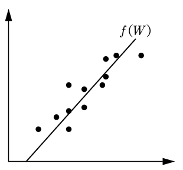
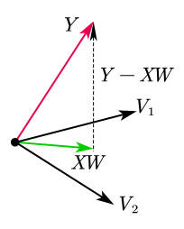

# 线性回归(Linear Regression)

维基百科中，线性回归的定义如下：

!!! note 线性回归
    在统计学中，线性回归是利用称为线性回归方程的最小二乘函数对一个或多个自变量和因变量之间关系进行建模的一种回归分析。

简单来说就是给定一组数据$D = \{(x_1, y_1), (x_2, y_2), \cdots, (x_N, y_N)\}$，希望找到函数$f(W)$能够尽可能的拟合$x$和$y$之间的关系，如下图所示。



    
    
图 1



## 最小二乘估计(Least Squares Estimation, LSE)

线性回归任务中最经典的方法就是最小二乘估计，假设有$N$个数据组成数据集$D = \{(x_1, y_1), (x_2, y_2), \cdots, (x_N, y_N)\}$，其中$x_i \in \mathbb{R}^p, y_i \in \mathbb{R}, i = 1, 2, ⋯, N$。为了方便，可以使用矩阵的形式表述数据集:
$$
\begin{equation} \tag{1} \label{1}
    X = (x_1, x_2, ⋯, x_N)^\top =
    \begin{bmatrix}
        x_{11} & x_{12} & \cdots & x_{1p} \\
        x_{21} & x_{22} & \cdots & x_{2p} \\
        \vdots & \vdots & \ddots & \vdots \\
        x_{N1} & x_{N2} & \cdots & x_{Np}
    \end{bmatrix}_{N \times p},
    Y =
    \begin{bmatrix}
        y_1 \\ y_2 \\ \vdots \\ y_N
    \end{bmatrix}_{N×1}
\end{equation}
$$

根据图一所示，可以将需要拟合的直线表示为：
$$
\begin{equation} \tag{2} \label{2}
    f(W) = W^\top x,
    W = \begin{bmatrix}
        w_1 \\ w_2 \\ \vdots \\ w_p
    \end{bmatrix}
\end{equation}
$$

其中，$W$向量就是线性回归任务中需要找到的参数。

!!! note 偏置(Bias)
    通常来说，式(2)中还包含了偏置项$b$，即
    $$
    \begin{equation} \notag
        f(W) = W^\top X + b
    \end{equation}
    $$
    这是一个常数项，但通常为了方便表示，会将偏置项$b$省略。

> 可以通过下面的推导看到为什么可以将偏置项省略：
    $$
    \begin{equation} \notag
        \begin{aligned}
            f(W) &= W^\top x + \textcolor{red}{b} \\
            &= \begin{bmatrix}
                w_1 & w_2 & \cdots & w_p
            \end{bmatrix}
            \begin{bmatrix}
                x_1 \\ x_2 \\ \vdots \\ x_p
            \end{bmatrix} + \textcolor{red}{b} \\
            &= w_1 x_1 + w_2 x_2 + \cdots + w_p x_p + \textcolor{red}{b} \\
            &= w_1 x_1 + w_2 x_2 + \cdots + w_p x_p + \textcolor{red}{w_0 \times 1} \Longrightarrow \text{将$b$表示为$w_0 \times 1$} \\
            &= \begin{bmatrix}
                w_1 & w_2 & \cdots & w_p & \textcolor{red}{w_0}
            \end{bmatrix}
            \begin{bmatrix}
                x_1 \\ x_2 \\ ⋮ \\ x_p \\ \textcolor{red}{1}
            \end{bmatrix} \\
            &= (W^\prime)^\top X^\prime
        \end{aligned}
    \end{equation}
    $$

最小二乘法中会定义一个目标函数，通常会被称为损失函数(Loss Function)。简单来说，损失函数刻画的是$f(x; W)$与真实数据中的$y$之间的误差，公式如下：
$$
\begin{equation} \tag{3} \label{3}
    \begin{aligned}
        L(W) &= \sum_{i=1}^N \| W^\top x_i - y_i \|_2^2 \\
        &= \sum_{i=1}^N (W^\top x_i - y_i)^2 \\
        &= \begin{bmatrix}
            W^\top x_1 - y_1 & W^\top x_2 - y_2 & \cdots & W^\top x_N - y_N
        \end{bmatrix}
        \underbrace{\begin{bmatrix}
            W^\top x_1 - y_1 \\ W^\top x_2 - y_2 \\ \vdots \\ W^\top x_N - y_N
        \end{bmatrix}}_{\text{$=$左边项的转置}} \\
        &= \left(
            W^\top \begin{bmatrix}
                x_1 & x_2 & \cdots & x_N
            \end{bmatrix} -
            \begin{bmatrix}
                y_1 & y_2 & \cdots & y_N
            \end{bmatrix}
        \right)
        \begin{bmatrix}
            W^\top x_1 - y_1 \\
            W^\top x_2 - y_2 \\
            \vdots \\
            W^\top x_N - y_N
        \end{bmatrix} \\
        &= (W^\top X^\top - Y^\top)\underbrace{(X W - Y)}_{\text{左边项直接转置}} \\
        &= W^\top X^\top X W - W^\top X^\top Y - Y^\top X W + Y^\top Y
    \end{aligned}
\end{equation}
$$

通过最小化损失函数就可以求解出参数$W$，即：
$$
\begin{equation} \tag{4} \label{4}
    \hat{W} = \arg \min_W L(W)
\end{equation}
$$

通过$\eqref{3}$式的结果可以看到，目标函数$L(W)$已经是显式表达式，因此可以进行直接求解。于是，令$\frac{\partial L(W)}{\partial W} = 0$即可求出$W$的解析解。

$\frac{\partial L(W)}{\partial W}$属于矩阵求导，回顾[《矩阵求导（三）：向量和矩阵作为变量的标量函数》](https://tao-oooo.github.io/%E7%9F%A9%E9%98%B5%E6%B1%82%E5%AF%BC%EF%BC%88%E4%B8%89%EF%BC%89%EF%BC%9A%E5%90%91%E9%87%8F%E5%92%8C%E7%9F%A9%E9%98%B5%E4%B8%BA%E5%8F%98%E9%87%8F%E7%9A%84%E6%A0%87%E9%87%8F%E5%87%BD%E6%95%B0%E6%B1%82%E5%AF%BC%E6%96%B9%E6%B3%95/index.html)笔记中的内容可知：在求导前需要(1)先确定矩阵求导的类型，(2)再确定矩阵导数的尺寸。

根据$L(W)$的定义可知，$L(W)$是变量为向量的标量函数，可以使用矩阵的迹和全微分作为辅助求导工具。同时，分子为标量，分母尺寸为$(p \times 1)$，所以分母布局的矩阵导数维度是$(p \times 1)$，分子布局的矩阵导数维度即为$(1 \times p)$。

因此，首先计算$L(W)$的全微分$\mathrm{d}L(W)$，即：
$$
\begin{equation} \tag{5} \label{5}
    \begin{aligned}
        \mathrm{d} L(W) &= \mathrm{d} \left(
            W^\top X^\top X W - W^\top X^\top Y - Y^\top X W + Y^\top Y
        \right) \\
        &= \text{tr}\left(
            \mathrm{d} \left(
                W^\top X^\top X W - W^\top X^\top Y - Y^\top X W + Y^\top Y
            \right)
        \right) \\
        &= \text{tr}\left(
            \mathrm{d} \left(
                W^\top X^\top X W
            \right)
        \right) - \text{tr}\left(
            \mathrm{d} \left(
                W^\top X^\top Y
            \right)
        \right) - \text{tr} \left(
            \mathrm{d} \left(
                Y^\top X W
            \right)
        \right) \\
        &= \text{tr}\left(
            \mathrm{d}(W^\top) X^\top X W + W^\top X^\top X \mathrm{d}(W)
        \right) - \text{tr}\left(
            \mathrm{d}(W^\top) X^\top Y
        \right) - \text{tr}\left(
            Y^\top X \mathrm{d}(W)
        \right) \\
        &= \text{tr}\left(
            X^\top X W \mathrm{d}(W^\top)
        \right) + \text{tr}\left(
            W^\top X^\top X \mathrm{d}(W)
        \right) - \text{tr}\left(
            X^\top Y \mathrm{d}(W^\top)
        \right) - \text{tr}\left(
            Y^\top X \mathrm{d}(W)
        \right) \\
        &= \text{tr}\left(
            W^\top X^\top X \mathrm{d}(W)
        \right) + \text{tr}\left(
            W^\top X^\top X \mathrm{d}(W)
        \right) - \text{tr}\left(
            Y^\top X \mathrm{d}(W)
        \right) - \text{tr}\left(
            Y^\top X \mathrm{d}(W)
        \right) \\
        &= \text{tr}\left(
            \left(
                2 W^\top X^\top X - 2 Y^\top X
            \right) \mathrm{d}(W)
        \right)
    \end{aligned}
\end{equation}
$$

于是可以得到分子布局的矩阵导数为：
$$
\begin{equation} \tag{6} \label{6}
    \frac{\partial L(W)}{\partial W^\top} = 2 W^\top X^\top X - 2 Y^\top X
\end{equation}
$$

通过式$\eqref{6}$可以知道最终的矩阵导数尺寸为$(1 \times p)$，与预期的维度一致。于是，分母布局(梯度向量)的矩阵导数即为式$\eqref{6}$的转置：
$$
\begin{equation} \tag{7} \label{7}
    \frac{\partial L(W)}{\partial W} = 2 X^\top X W - 2 X^\top Y
\end{equation}
$$

这时令$\frac{\partial L(W)}{\partial W} = 0$即可求出最优解：
$$
\begin{equation} \tag{8} \label{8}
    \frac{\partial L(W)}{\partial W} = 2 X^\top X W - 2 X^\top Y = 0
\end{equation}
$$

最终可得参数$W$为：
$$
\begin{equation} \tag{9} \label{9}
    \boxed{\hat{W} = (X^\top X)^{-1} X^\top Y}
\end{equation}
$$

实际上，$(X^\top X)^{-1} X^\top$这部分被称为矩阵$X$的伪逆，通常可以记作$X^\dagger$。

## 最小二乘法的几何意义

再次回顾上面这个问题，我们有$N$个数据，需要找到一个$W$，使得$f(W)$尽可能地拟合数据，这里用矩阵来表示$f(W)$。
$$
\begin{equation} \tag{10} \label{10}
    \begin{bmatrix}
        W^\top x₁ \\ W^\top x₂ \\ \vdots \\ W^\top x_N
    \end{bmatrix} =
    \begin{bmatrix}
        w_1 x_{11} + w_2 x_{12} + \cdots + w_p x_{1p} \\
        w_1 x_{21} + w_2 x_{22} + \cdots + w_p x_{2p} \\
        \vdots \\
        w_1 x_{N1} + w_2 x_{N2} + \cdots + w_p x_{Np}
    \end{bmatrix} = X W
\end{equation}
$$

所以，线性回归任务就是需要$XW$与$Y$尽可能地接近。

现在从几何角度看待这个问题，如果我们将$N$个$p$维数据向量看成是$p$个长度为$N$的向量，那么可以看作所有的样本构建了一个$p$维子空间。就像图二中向量$V_1$和$V_2$可以构成了一个2维空间(平面)。
$$
\begin{equation} \tag{11} \label{11}
    X = \begin{bmatrix}
        x_1 & x_2 & \cdots & x_N
    \end{bmatrix}^\top =
    \begin{bmatrix}
        x_{11} & x_{12} & \cdots & x_{1p} \\
        x_{21} & x_{22} & \cdots & x_{2p} \\
        \vdots & \vdots & \ddots & \vdots \\
        x_{N1} & x_{N2} & \cdots & x_{Np}
    \end{bmatrix}_{N \times p} =
    \begin{bmatrix}
        V_1 & V_2 & \cdots & V_p
    \end{bmatrix}_{N \times p}
\end{equation}
$$



    
    
图 2



因为噪声的存在，所以实际上$Y$无法完全由$(V_1, V_2, \cdots, V_p)$表示(总是存在误差)，因此$Y$并不在这个$p$维子空间中。而线性回归任务的目的是找到与$Y$最近的向量$XW$，并且$XW$可由$X$表示。所以，线性回归的目的是在$p$维子空间中找到与$Y$最接近的$XW$。

从几何的角度可知，与$Y$最近的$XW$其实就是$Y$在$p$维子空间的投影，即图二中的$XW$。通过向量的运算可知，图二中的虚线向量为$Y - XW$。因为$XW$是$Y$的投影，所以$Y - XW$那么是$p$维空间的法向量。简单来说，$Y - XW$垂直于$p$个$N$维向量，即：
$$
\begin{equation} \tag{12} \label{12}
    (Y - XW) \perp X
\end{equation}
$$

因此$Y - XW$和$V_i$的内积为$0$，$Y - XW$和$X$就满足如下关系：
$$
\begin{equation} \tag{13} \label{13}
    X^\top (Y - XW) = 0_{p \times 1}
\end{equation}
$$

求解上述方程可以同样可以得到参数$W$，并且与最小二乘估计的结果一致：
$$
\begin{equation} \tag{14} \label{14}
    \boxed{W = (X^\top X)^{-1} X^\top Y}
\end{equation}
$$

## 概率视角下的线性回归

上面提到，因为噪声的存在，$F(W)$无法完全拟合数据。所以，不妨假设噪声服从如下的高斯分布：
$$
\begin{equation} \tag{15} \label{15}
    \varepsilon \sim \mathcal{N}(0, \sigma^2)
\end{equation}
$$

于是，需要拟合的函数$y$可以表示为如下的形式：
$$
\begin{equation} \tag{16} \label{16}
    \begin{cases}
        y = f(W) + \varepsilon, & \varepsilon \sim \mathcal{N}(0, \sigma^2) \\
        f(W) = W^\top x
    \end{cases}
\end{equation}
$$

根据高斯分布的性质可得条件随机变量$y|x$服从如下分布：
$$
\begin{equation} \tag{17} \label{17}
    y | x; W \sim \mathcal{N}(W^\top x, \sigma^2)
\end{equation}
$$

其中，因为$x$是条件，所以$W^\top x$可以看作常数项。

接下来使用极大似然估计来求解这个问题，它的目标函数是对数似然函数：
$$
\begin{equation} \tag{18} \label{18}
    \begin{aligned}
        L(W) &= \log P(Y | X; W) \\
        &= \log \prod_{i=1}^N P(y_i | x_i; W) \Longrightarrow \text{因为独立同分布样本，可以展开为连乘形式} \\
        &= \log \prod_{i=1}^N \frac{1}{\sqrt{2\pi} \sigma} \exp
        \left[
            -\frac{(y_i - W^\top x_i)^2}{2 \sigma^2}
        \right] \Longrightarrow \text{将高斯分布表达式代入} \\
        &= \sum_{i=1}^N \log \frac{1}{\sqrt{2\pi} \sigma} - \sum_{i=1}^N \frac{(y_i - W^\top x_i)^2}{2\sigma^2} \Longrightarrow \text{对数连乘变为连加}
    \end{aligned}
\end{equation}
$$

极大似然估计的目标是最大化对数似然函数，即：
$$
\begin{equation} \tag{19} \label{19}
    \begin{aligned}
        \hat{W} &= \arg \max_W L(W) \\
        &= \arg \max_W \left[ - \sum_{i=1}^N \frac{(y_i - W^\top x_i)^2}{2\sigma^2} \right] \Longrightarrow \text{分母$\sigma$与优化目标无关，可以省略} \\
        &= \arg \min_W \sum_{i=1}^N (y_i - W^\top x_i)^2 \Longrightarrow \text{负号与最大化变成最小化}
    \end{aligned}
\end{equation}
$$

从上式可以看到，使用极大似然估计方法的目标函数与最小二乘法的目标函数一致。因此，在线性回归算法中，最小二乘法实际上就是噪声为高斯分布情况下的极大似然估计，即：
$$
\begin{equation} \notag
    \boxed{\text{LSE} \Longleftrightarrow \text{MLE + Noise (Noise is Gaussian Dist.)}}
\end{equation}
$$

# 参考文献

[1]Bilibili《白板推导机器学习》系列

[2]C. M. Bishop. 《Pattern recognition and machine learning》
