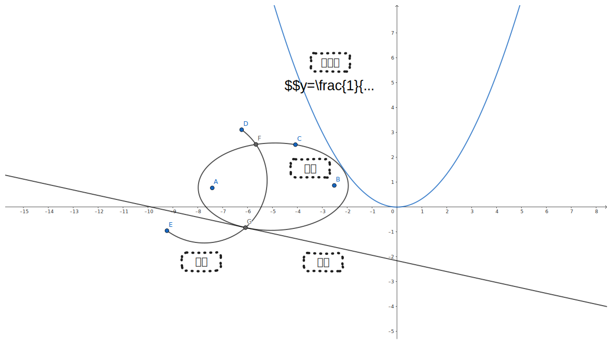

# 概述

在记笔记或者写文章的过程中，我们经常需要绘制插图。特别对于理工科相关科目而言，插图中通常还会包含更多的内容，比如**数学公式、函数图像、流程图和手绘框图**等等。然而这些元素往往只能使用单独的软件完成，而无法在同一个软件中全部实现。这篇文章的目的就是记录如何将数学公式、函数图像、流程图和手绘框图等等元素放入到同一张插图中，并且最终插图能够在 Markdown 文档中被导入。

# 作图软件
## Draw.io

常用的流程图绘制软件 (当然不仅限于流程图绘制) ，并且文本可以支持解析 Markdown 公式语法。

## Excalidraw

支持手绘风格的绘图软件，但是不支持 Markdown 公式语法 (据说在 Obsidian 中使用 Excalidraw 可以支持插入 Markdown 公式) 。

## GeoGebra 和 Inkscape

GeoGebra 和 Inkscape 两款软件都可以免费绘制数学相关的图像。

## 作图软件之间的相互配合

上述几个软件绘制的图像最终都可以保存为 `.svg` 格式，通过 `.svg` 图像可以在不同的软件中导入。通过相互配合使用，就可以在同一张图片上实现**数学几何绘图**、 **Markdown 公式输入**、**手绘风格笔记**等特征。

# 在 Markdown 笔记中插入上述作图软件绘制的图像

先将绘制完成的图片导出为 `.svg` 格式，然后使用插入图片语法即可。下图中包含了上述提到的一些元素。

# 参考文献

[科研作图：写论文、作业时用得到的作图软件](https://zhuanlan.zhihu.com/p/496086808)